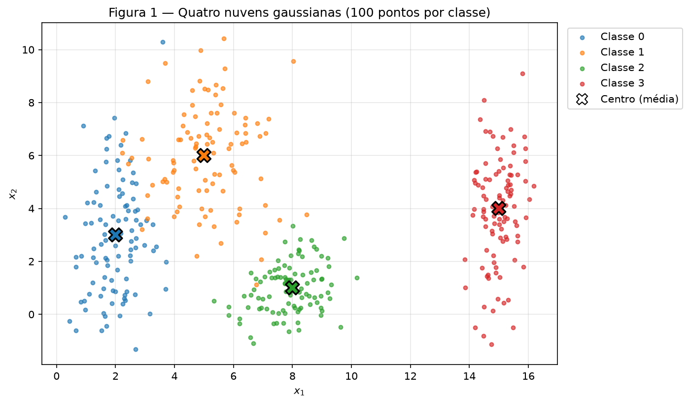
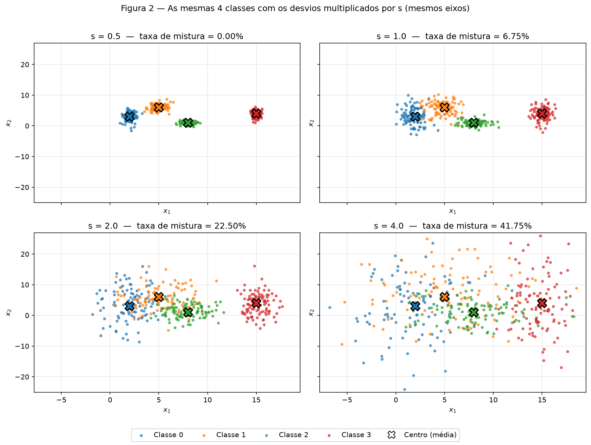
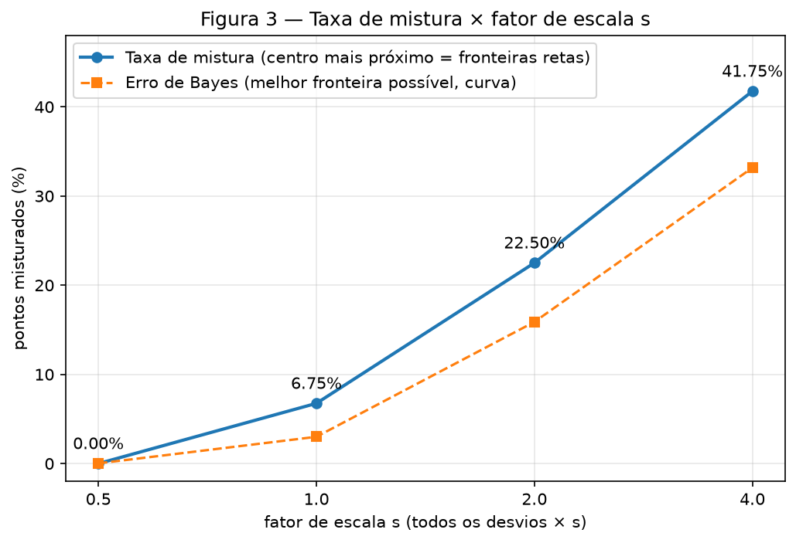
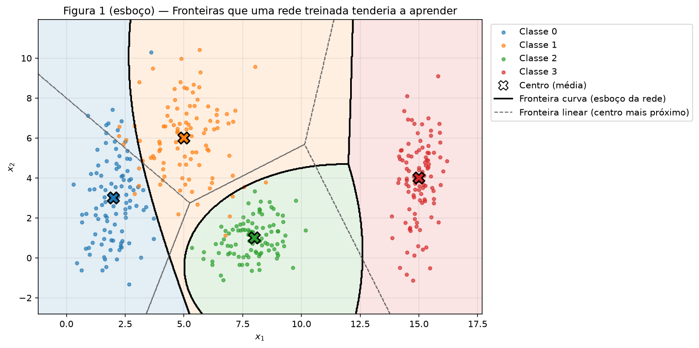
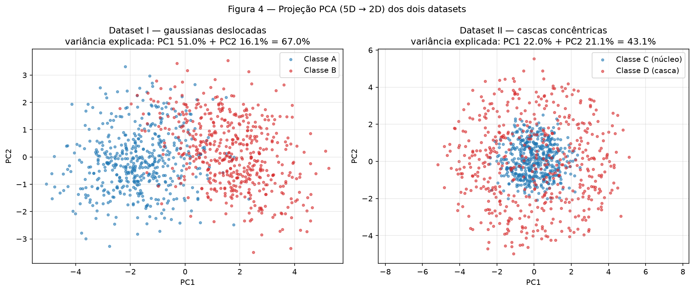
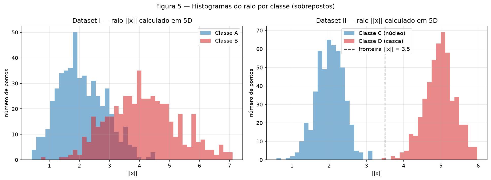
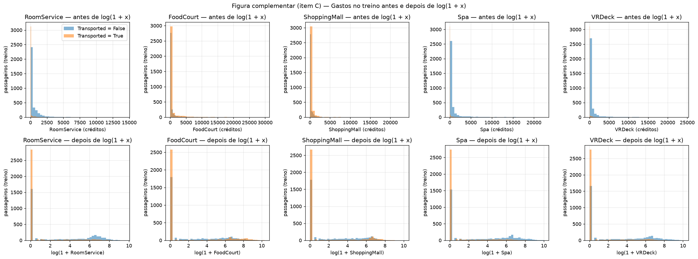
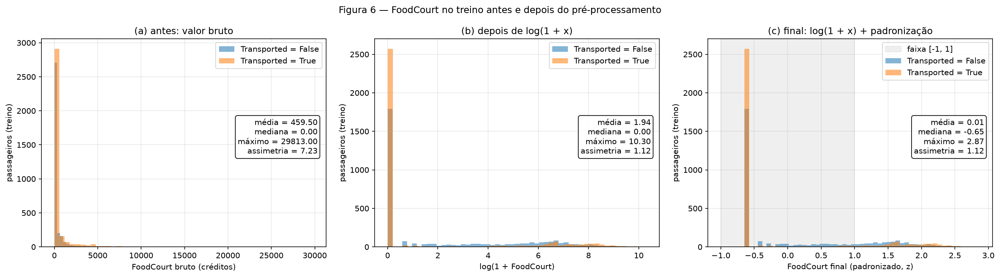

# 1. Data — Preparação e análise de dados para redes neurais

!!! info "Como reproduzir"

    ```bash
    python3 -m pip install -r requirements.txt
    python3 docs/exercises/data/code/main.py
    ```

    `main.py` cria **um único** gerador `rng = np.random.default_rng(42)` e o passa, nessa ordem,
    para os Exercícios 1, 2 e 3. O script regrava todas as figuras em `figures/` e todos os
    números em `code/results.json`. Todo número citado neste relatório vem desse arquivo.
    Nenhum modelo é treinado: só se usam NumPy, pandas, Matplotlib e, do scikit-learn,
    `PCA`, `SimpleImputer`, `OneHotEncoder` e `StandardScaler`.

!!! note "Uso de IA"

    Feito com auxílio de IA.

| Arquivo | Conteúdo |
|---------|----------|
| `code/main.py` | ponto de entrada: seed única, roda os 3 exercícios, grava `results.json` |
| `code/ex1_point_clouds.py` | Exercício 1: nuvens 2D, razão de separação, taxa de mistura, Figuras 1–3 |
| `code/ex2_nonlinearity.py` | Exercício 2: datasets 5D, PCA, distâncias e raios, Figuras 4–5 |
| `code/ex3_spaceship.py` | Exercício 3: descrição, divisão, pré-processamento, Figura 6 |
| `code/data/train.csv` | `train.csv` do Spaceship Titanic (Kaggle), 8693 linhas × 14 colunas |

??? example "Código — `main.py`"

    ``` python
    --8<-- "docs/exercises/data/code/main.py"
    ```

---

## Exercício 1

**Nuvens de pontos: geometria e espalhamento em 2D.**
*Abordagem:* gerar as quatro gaussianas 2D, repetir a geração com os desvios multiplicados
por $s$ e medir o espalhamento só com geometria: a razão de separação $r_{ij}$, a taxa de
mistura (centro mais próximo) e um teste exato de separabilidade por reta entre pares de
classes. Para o esboço de fronteiras usei a regra de Bayes calculada com os parâmetros
verdadeiros, que conhecemos porque nós mesmos geramos os dados. É a fronteira que uma rede
bem treinada tende a aproximar, e ela é obtida sem treinar nada.

??? example "Código completo — `ex1_point_clouds.py`"

    ``` python
    --8<-- "docs/exercises/data/code/ex1_point_clouds.py"
    ```

### A — Gere as nuvens

`generate_clouds(rng)` sorteia 100 pontos por classe com `rng.normal(média, desvio)`, eixo a
eixo. Como o enunciado dá um desvio por eixo, as coordenadas são independentes (covariância
diagonal). São 400 pontos, com 100 por classe. A tabela compara os parâmetros com os valores
amostrais:

| Classe | Média especificada | Média amostral | Desvio especificado | Desvio amostral |
|:------:|:------------------:|:--------------:|:-------------------:|:---------------:|
| 0 | (2, 3)  | (1.99, 2.88)  | (0.8, 2.5) | (0.73, 2.14) |
| 1 | (5, 6)  | (5.07, 5.96)  | (1.2, 1.9) | (1.28, 1.86) |
| 2 | (8, 1)  | (7.90, 0.98)  | (0.9, 0.9) | (0.91, 0.92) |
| 3 | (15, 4) | (14.99, 3.88) | (0.5, 2.0) | (0.52, 2.02) |


/// caption
**Figura 1** — As quatro nuvens ($s = 1$), uma cor por classe; o **X** marca o centro (média) de cada nuvem.
///

### B — Mais ou menos espalhado

Para cada $s \in \{0.5, 1.0, 2.0, 4.0\}$, as **mesmas 4 classes** são geradas de novo, com 100
pontos por classe e todos os desvios multiplicados por $s$. As médias não mudam. São 4 datasets
de 4 classes cada (1600 pontos no total), mostrados na Figura 2 com os mesmos limites de eixo.


/// caption
**Figura 2** — Os quatro datasets, um por valor de $s$, com eixos compartilhados.
///

**Razão de separação em $s = 1$** (`separation_ratios`), com
$\bar\sigma_k = (\sigma_{k,x} + \sigma_{k,y})/2$:

| Par $(i, j)$ | $\lVert \mu_i - \mu_j \rVert$ | $\bar\sigma_i$ | $\bar\sigma_j$ | $r_{ij}$ |
|:---:|:---:|:---:|:---:|:---:|
| **0–1** | **4.243** | **1.65** | **1.55** | **1.326** ← menor |
| 0–2 | 6.325 | 1.65 | 0.90 | 2.480 |
| 0–3 | 13.038 | 1.65 | 1.25 | 4.496 |
| 1–2 | 5.831 | 1.55 | 0.90 | 2.380 |
| 1–3 | 10.198 | 1.55 | 1.25 | 3.642 |
| 2–3 | 7.616 | 0.90 | 1.25 | 3.542 |

O menor é o par **0–1, com $r_{01} = 1.326$**. Como as médias são fixas e todo $\bar\sigma$ é
multiplicado por $s$, vale $r_{ij}(s) = r_{ij}(1)/s$. Em **$s = 2$**, então,
**$r_{01} = 1.326/2 = 0.663$**, sem gerar nada novo. Pelo mesmo raciocínio, $r_{01} = 2.652$ em
$s = 0.5$ e $0.331$ em $s = 4$.

**Taxa de mistura** (`mixing_rate`): cada ponto é comparado com os 4 centros e conta como
misturado quando o centro mais próximo não é o da sua classe. Para complementar, calculei
também, para cada par de classes, se existe *alguma* reta que separe os dois conjuntos
(`linearly_separable`). Em 2D, dois conjuntos são separáveis por uma reta se existe uma direção
$w$ em que as projeções não se sobrepõem, $\max_a w^\top a < \min_b w^\top b$. O código varre
3600 direções. Por último, estimei o **erro de Bayes**, isto é, o erro da melhor fronteira
possível, com 20 000 pontos por classe e os parâmetros verdadeiros (`bayes_error`).

| $s$ | Pontos misturados | **Taxa de mistura** | Direções da mistura (verdadeira→centro) | Pares separáveis por reta | $r_{\min}(s)$ | Erro de Bayes |
|:---:|:---:|:---:|:---|:---:|:---:|:---:|
| 0.5 | 0/400 | **0.00%** | nenhuma | 6/6 | 2.652 | 0.02% |
| 1.0 | 27/400 | **6.75%** | 0→1: 11, 1→0: 11, 1→2: 4, 0→2: 1 | 4/6 (falham 0–1 e 1–2) | 1.326 | 3.00% |
| 2.0 | 90/400 | **22.50%** | 0→1: 37, 1→0: 20, 1→2: 17, 2→1: 8, 0→2: 6, 2→3: 2 | 3/6 (falham 0–1, 0–2, 1–2) | 0.663 | 15.88% |
| 4.0 | 167/400 | **41.75%** | 11 das 12 direções possíveis ocorrem | 0/6 | 0.331 | 33.17% |


/// caption
**Figura 3** — Taxa de mistura × $s$ (linha cheia). A linha tracejada é o erro de Bayes, o mínimo que qualquer fronteira, reta ou curva, consegue.
///

**A partir de qual $s$ as nuvens deixam de ser separáveis por retas?** Entre os valores testados,
**a partir de $s = 1$**. Em $s = 0.5$ a taxa de mistura é 0% e os 6 pares são separáveis por
reta, logo um conjunto de retas separa tudo sem erro. Em $s = 1$ a taxa sobe para 6.75% e os
pares 0–1 e 1–2 já têm pontos do lado errado de *qualquer* reta. **Nesse ponto o menor $r_{ij}$
(par 0–1) cai de 2.65 para 1.33**: a distância entre os centros 0 e 1 (4.24) passa a ser só 1.3
vez a soma dos espalhamentos médios (3.2), e as caudas das duas nuvens se encontram. Em $s = 2$
temos $r_{01} = 0.66 < 1$, e a soma dos espalhamentos já supera a distância entre os centros.
Em $s = 4$ ($r_{01} = 0.33$) nenhum par continua separável.

Uma ressalva sobre $r_{ij}$: ele é um resumo, porque $\bar\sigma$ faz a média dos dois eixos, mas
o que decide a sobreposição é o espalhamento **na direção que liga os centros**. Por isso o par
0–3 continua separável em $s = 2$ com $r = 2.25$, enquanto o par 1–2 já não é em $s = 1$ com
$r = 2.38$. As classes 0 e 3 se separam ao longo de $x_1$, onde seus desvios são pequenos (0.8 e
0.5). Já os centros 1 e 2 estão alinhados quase na vertical, justamente o eixo em que a classe 1
se espalha mais ($\sigma_y = 1.9$).

### C — Análise

**Sobreposição em $s = 1$.** Na Figura 1, a classe 3 está isolada: há uma faixa vazia em $x_1$
entre 10.18 (maior $x_1$ das classes 0–2) e 13.84 (menor $x_1$ da classe 3). A classe 2, compacta
($\sigma = 0.9$), fica embaixo, quase sem contato com as outras. A sobreposição real está entre
**0 e 1**: a classe 0 é alta ($\sigma_y = 2.5$) e invade a região da classe 1 por volta de
$x_1 \approx 3$–$4$, $x_2 \approx 4$–$7$. Há também um contato menor entre **1 e 2**, perto de
$(6.5, 3)$. Nos dados da Figura 1, a taxa de mistura é 5.0% (20 de 400 pontos: 8 da classe 0
mais perto do centro 1, 6 da classe 1 mais perto do centro 0, 6 da classe 1 mais perto do
centro 2). Os pares 0–1 e 1–2 **não** são separáveis por reta; os outros quatro pares são.

* **Uma única fronteira linear** não separa as quatro classes: uma reta divide o plano em só dois
  semiplanos, e com quatro classes são necessárias pelo menos três fronteiras.
* **Um conjunto de fronteiras lineares** resolve quase tudo. Uma reta vertical em
  $x_1 \approx 12$ isola a classe 3 sem erro, e retas entre 0|1, 1|2 e 0|2 formam regiões
  poligonais (as linhas tracejadas da figura abaixo são as do centro mais próximo). Mas, como 0–1
  e 1–2 não são linearmente separáveis, qualquer conjunto de retas ainda erra alguns pontos: com
  as retas do centro mais próximo, são 20 erros (5.0%).


/// caption
**Figura 1 (esboço)** — Em preto, as fronteiras que uma rede treinada tenderia a aprender (regra de Bayes com os parâmetros verdadeiros). Em cinza tracejado, as fronteiras lineares do centro mais próximo.
///

**Esboço das fronteiras.** As curvas pretas mostram o que uma rede com tanh e algumas unidades
ocultas consegue aprender ao compor vários semiplanos:

1. entre 0 e 1, uma curva que contorna a classe 0, estreita em $x_1$ ($\sigma_x = 0.8$) e alta em
   $x_2$ ($\sigma_y = 2.5$);
2. em volta da classe 2, compacta e isotrópica, uma região arredondada, fechada por cima e pelos
   lados; pontos longe dela são atribuídos a classes mais espalhadas;
3. para a classe 3, uma fronteira quase vertical em $x_1 \approx 12$, dentro da faixa vazia.

Nos dados da Figura 1, a regra curva erra 13 pontos (3.25%), contra 20 (5.0%) das retas. As
fronteiras curvas batem com os dados porque dobram exatamente onde as nuvens têm formatos
diferentes.

**Relação com o item B.** A região em que a rede **necessariamente** erra é aquela em que as
densidades de duas classes são comparáveis. Um ponto ali pode ter vindo de qualquer uma delas.
O tamanho dessa região é medido pelo erro de Bayes, que cresce de 0.02% ($s = 0.5$) para 3.00%
($s = 1$), 15.88% ($s = 2$) e 33.17% ($s = 4$), acompanhando a queda de $r_{\min}$, que é
proporcional a $1/s$. Nenhuma arquitetura desce abaixo desse piso. Uma fronteira curva ganha, no
máximo, a diferença entre a linha cheia e a tracejada da Figura 3 (6.75% contra 3.00% em
$s = 1$; 41.75% contra 33.17% em $s = 4$). Com nuvens muito espalhadas, o erro passa a vir da
própria sobreposição dos dados, não da forma da fronteira.

---

## Exercício 2

**Não-linearidade em dimensões maiores.**
*Abordagem:* gerar os dois datasets 5D, projetá-los com PCA e medir, **em 5D**, a distância entre
os centros e o raio $\lVert x \rVert$ de cada ponto. Para sustentar a análise sem treinar modelos,
avaliei regras fixadas antes de olhar os dados: o hiperplano mediador entre os centros (linear) e
o limiar radial $\lVert x \rVert = 3.5$, ponto médio entre os raios 2 e 5.

??? example "Código completo — `ex2_nonlinearity.py`"

    ``` python
    --8<-- "docs/exercises/data/code/ex2_nonlinearity.py"
    ```

### A — Dataset I: gaussianas deslocadas

`dataset_one(rng)` chama `rng.multivariate_normal` com $\mu_A = \mathbf{0}$, $\Sigma_A$,
$\mu_B = 1.5\cdot\mathbf{1}$ e $\Sigma_B$, exatamente como no enunciado (as matrizes estão em
`SIGMA_A` e `SIGMA_B` no código), com 500 amostras por classe. Verificações:

* as duas matrizes são covariâncias válidas, positivas definidas: o menor autovalor é 0.158 em
  $\Sigma_A$ e 0.498 em $\Sigma_B$;
* médias amostrais: A ≈ (−0.05, −0.06, 0.06, −0.01, −0.10) e B ≈ (1.55, 1.44, 1.46, 1.45, 1.53);
* maior diferença entre covariância amostral e especificada: 0.10 (A) e 0.17 (B), coerente com
  500 amostras;
* correlação entre $x_1$ e $x_2$: +0.78 em A (esperado 0.8/1.0 = 0.80) e −0.46 em B (esperado
  −0.7/1.5 = −0.47). A correlação tem o sinal oposto entre as classes, como pede o enunciado.

### B — Dataset II: cascas concêntricas

`unit_directions` sorteia $v \sim \mathcal{N}(0, I_5)$ e normaliza, $u = v/\lVert v \rVert$. Como a
normal padrão é invariante a rotações, $u$ é uniforme na esfera unitária de $\mathbb{R}^5$; o
maior desvio de $\lVert u \rVert$ em relação a 1 é $2.2 \times 10^{-16}$, erro de ponto
flutuante. O raio é $\rho \sim \mathcal{N}(2.0, 0.4)$ na classe C (núcleo) e
$\mathcal{N}(5.0, 0.4)$ na classe D (casca), com 0.4 lido como **desvio padrão**, a mesma
convenção do Exercício 1. Cada ponto é $x = \rho\,u$. Raios amostrais: C = 2.02 ± 0.38 e
D = 4.97 ± 0.41.

### C — Visualize e compare

A PCA é ajustada separadamente em cada dataset (1000 pontos, sem usar o rótulo) e projeta os
dados em 2 componentes (`pca_2d`).


/// caption
**Figura 4** — Projeção PCA 5D → 2D. À esquerda, Dataset I; à direita, Dataset II.
///

| | PC1 | PC2 | **PC1 + PC2** |
|---|:---:|:---:|:---:|
| Dataset I | 50.95% | 16.08% | **67.03%** |
| Dataset II | 21.99% | 21.10% | **43.09%** |

No Dataset II a variância se divide quase igualmente entre as 5 direções, cerca de 20% cada, como
esperado de uma distribuição isotrópica. Duas componentes guardam, então, só cerca de 40%.

**Qual projeção preserva melhor a informação para classificar? A do Dataset I.** O hiperplano
mediador entre os centros verdadeiros acerta 89.1% em 5D e 89.4% no plano da PCA (com os centros
projetados pela mesma PCA), ou seja, a projeção não perde nada relevante. Isso acontece porque a
direção de maior variância (PC1, 51%) coincide com a direção do deslocamento entre as médias. No
Dataset II, 37.8% dos pontos da casca caem **dentro do disco ocupado pelo núcleo** na projeção,
enquanto em 5D a sobreposição é zero (ver abaixo).

**Medidas geométricas em 5D** (`center_distance`, `np.linalg.norm`):

| | Dataset I | Dataset II |
|---|:---:|:---:|
| **Distância entre centros** $\lVert \mu_1 - \mu_2 \rVert$ | **3.398** (teórico $1.5\sqrt5 = 3.354$) | **0.229** (teórico 0) |
| Raio médio da 1ª classe | 2.09 (A) | 2.02 (C) |
| Raio médio da 2ª classe | 4.12 (B) | 4.97 (D) |
| Os histogramas de raio se sobrepõem? | sim, bastante | **não**: máx(C) = 3.158 < mín(D) = 3.522 |


/// caption
**Figura 5** — Histograma do raio $\lVert x \rVert$ (calculado em 5D) de cada ponto, com as classes sobrepostas. No Dataset II, a linha tracejada marca a fronteira $\lVert x \rVert = 3.5$.
///

### D — Análise

**1. Centros coincidentes × raios separados.** No Dataset II os centros ficam a só 0.229 um do
outro (teoricamente em cima um do outro), mas os raios não se tocam: o maior raio do núcleo é
3.158 e o menor da casca é 3.522. Isso diz que a informação que separa as classes está na
*distância à origem*, e não na *posição média*. Um hiperplano $w^\top x = b$ só consegue separar
classes que diferem na média em alguma direção, e aqui, para toda direção $w$, as projeções
$w^\top x$ das duas classes têm média ≈ 0. A casca simplesmente se estende para os **dois**
lados, além do núcleo. O hiperplano mediador entre os centros amostrais acerta **54.4%**, quase
um chute.

**2. Por que nenhum volume de dados resolve com uma fronteira linear.** A casca envolve o núcleo
em todas as direções. Qualquer semiespaço que contenha todos os pontos da casca contém também o
fecho convexo deles, e esse fecho é praticamente a bola de raio ≈ 5, que contém o núcleo inteiro.
Logo, nenhum hiperplano deixa a casca inteira de um lado e o núcleo do outro. Mais dados só
cobrem a esfera de raio 5 mais densamente, o que fecha ainda mais o fecho convexo em volta do
núcleo e agrava o problema. O limite não vem de ruído ou de amostra pequena, e sim da **forma**
das classes, uma bola dentro de uma casca, que não é linearmente separável.

**3. Uma projeção ruim prova inseparabilidade? Não.** A PCA é linear e escolhe direções pela
variância, não pelo rótulo. Na Figura 4 o Dataset II parece misturado (37.8% da casca cai no disco
do núcleo), porque projetar uma casca 5D em 2D preenche o disco inteiro: a projeção descarta 57%
da variância (fica com 43.09%), e é justamente nas componentes descartadas que está o raio. Em 5D,
porém, a função

$$
f(x) \;=\; \lVert x \rVert^2 - 3.5^2 \;=\; \sum_{i=1}^{5} x_i^2 \;-\; 12.25,
\qquad
\hat y = \begin{cases} \text{C (núcleo)} & f(x) < 0 \\ \text{D (casca)} & f(x) > 0 \end{cases}
$$

separa **100%** dos 1000 pontos (`radial_rule`). O limiar 3.5 é o ponto médio de 2 e 5, fixado
antes de gerar os dados, sem ajuste. $f$ é linear nas features $x_i^2$: uma camada oculta que
aprenda algo parecido com quadrados, ou várias unidades tanh que juntas cerquem uma região
fechada, torna o problema trivial. É exatamente o tipo de problema em que redes profundas superam
o perceptron.

---

## Exercício 3

**Preparando dados do mundo real para uma rede neural.**
*Abordagem:* descrever o `train.csv` inteiro (só estatística descritiva), dividir treino/teste
**antes** de calcular qualquer estatística usada numa transformação, e então ajustar (`fit`)
imputação, one-hot e padronização **só no treino**, aplicando (`transform`) o mesmo objeto ao
teste. O pré-processamento fica na classe `Preprocessor`.

??? example "Código completo — `ex3_spaceship.py`"

    ``` python
    --8<-- "docs/exercises/data/code/ex3_spaceship.py"
    ```

### A — Conheça os dados

O `train.csv` do [Spaceship Titanic](https://www.kaggle.com/competitions/spaceship-titanic){:target="_blank"}
tem **8693 passageiros × 14 colunas**. A história do dataset: no ano de 2912, a nave *Spaceship
Titanic* atravessou uma anomalia do espaço-tempo e quase metade dos passageiros foi transportada
para outra dimensão. **`Transported`** é o alvo binário: `True` se o passageiro foi transportado.
O objetivo é prever essa coluna a partir dos dados de cada passageiro.

**Balanceamento:** 4378 `True` (**50.36%**) contra 4315 `False` (49.64%). As classes estão
praticamente equilibradas, então não há necessidade de reamostragem, e um classificador
trivial acertaria ~50%.

**Tipos de features:**

| Tipo | Colunas |
|------|---------|
| Numéricas (contínuas) | `Age`, `RoomService`, `FoodCourt`, `ShoppingMall`, `Spa`, `VRDeck` |
| Categóricas nominais | `HomePlanet` (3 valores), `Destination` (3 valores) |
| Categóricas binárias | `CryoSleep`, `VIP` (`True`/`False`) |
| Categórica composta | `Cabin` (`deck/num/side`; 6560 valores distintos) |
| Texto / identificadores | `Name` (8473 distintos), `PassengerId` (`gggg_pp`, 8693 distintos) |
| Alvo | `Transported` (booleano) |

**Valores ausentes por coluna** (arquivo inteiro):

| Coluna | Ausentes | % |
|--------|---:|---:|
| PassengerId | 0 | 0.00 |
| HomePlanet | 201 | 2.31 |
| CryoSleep | 217 | 2.50 |
| Cabin | 199 | 2.29 |
| Destination | 182 | 2.09 |
| Age | 179 | 2.06 |
| VIP | 203 | 2.34 |
| RoomService | 181 | 2.08 |
| FoodCourt | 183 | 2.11 |
| ShoppingMall | 208 | 2.39 |
| Spa | 183 | 2.11 |
| VRDeck | 188 | 2.16 |
| Name | 200 | 2.30 |
| Transported | 0 | 0.00 |

Cada coluna perde só ~2%, mas **24.0% das linhas** têm pelo menos um ausente. Descartar linhas
jogaria fora um quarto dos dados, e por isso imputei em vez de descartar.

**Gastos (arquivo inteiro, ignorando ausentes):**

| Coluna | Média | Mediana | Máximo | % de zeros | Assimetria |
|--------|---:|---:|---:|---:|---:|
| RoomService | 224.69 | 0 | 14 327 | 65.5% | 6.33 |
| FoodCourt | 458.08 | 0 | 29 813 | 64.1% | 7.10 |
| ShoppingMall | 173.73 | 0 | 23 492 | 65.8% | 12.63 |
| Spa | 311.14 | 0 | 22 408 | 62.6% | 7.64 |
| VRDeck | 304.85 | 0 | 24 133 | 64.6% | 7.82 |

**Média × mediana.** A mediana é **0** em todas as colunas: mais da metade dos passageiros (62–66%)
não gasta nada. A média, na casa das centenas, fica muito acima da mediana porque é puxada por
poucos passageiros que gastam muito; os máximos chegam a 64–135 vezes a média. As distribuições
são, portanto, **fortemente assimétricas à direita** (assimetria entre 6 e 13), com um pico em
zero e uma cauda longa. O espalhamento é dominado por uma minoria: média e desvio padrão
descrevem mal o passageiro típico.

!!! warning "Nenhuma estatística do item A alimenta o pré-processamento"

    Os números acima descrevem o arquivo. Tudo o que é usado para **transformar** os dados
    (medianas, modas, categorias, média e desvio) é recalculado no item C, só no treino.

### B — Separe antes de transformar

`stratified_split(y, rng, test_size=0.2)` embaralha, com o **mesmo `rng` de seed 42**, os índices
de cada classe separadamente e reserva 20% de cada uma para o teste:

| | Linhas | % `Transported = True` |
|---|---:|---:|
| Treino | 6954 | 50.36% |
| Teste | 1739 | 50.37% |

Nenhuma linha aparece nos dois conjuntos (interseção = 0), e a proporção do alvo fica igual nas
duas partes, que é o objetivo da estratificação.

**Por que dividir antes de imputar e escalonar.** O conjunto de teste simula dados que o modelo
nunca viu, então nenhuma informação dele pode entrar no ajuste. Se a mediana de imputação, as
categorias do one-hot ou a média e o desvio do escalonamento fossem calculados no dataset inteiro,
os valores do teste vazariam para o treino (*data leakage*), e a nota no teste sairia otimista e
pouco confiável. Dividindo primeiro, toda estatística vem só do treino e é apenas *aplicada* ao
teste, como aconteceria em produção.

### C — Pré-processe

A ordem do pipeline, ajustado em `Preprocessor.fit(treino)` e aplicado por `transform` a treino e
teste, é: **imputação → `TotalSpend` → $\log(1+x)$ → padronização** nas numéricas e
**imputação → one-hot** nas categóricas.

**1. Dados ausentes.** Os imputadores são `SimpleImputer`, ajustados no treino:

| Tipo | Estratégia | Valores aprendidos no treino | Imputados (treino / teste) |
|------|-----------|------------------------------|------|
| Numéricas | **mediana** | `Age` = 27.0; os 5 gastos = 0.0 | Age 143/36, RoomService 138/43, FoodCourt 146/37, ShoppingMall 165/43, Spa 149/34, VRDeck 152/36 |
| Categóricas | **moda** | `HomePlanet` = Earth, `CryoSleep` = False, `Destination` = TRAPPIST-1e, `VIP` = False | HomePlanet 160/41, CryoSleep 173/44, Destination 136/46, VIP 162/41 |

*Justificativa.* Nas numéricas uso a mediana porque ela é robusta à cauda longa. A média de
`FoodCourt` no treino (459.50) imputaria um gasto que 64% dos passageiros não têm, enquanto a
mediana (0) coincide com o valor mais comum. Em `Age` a distribuição é pouco assimétrica, e a
mediana (27) fica perto da média (28.8). Nas categóricas uso a moda: cada coluna tem ~2% de
ausentes, a moda é o valor mais provável e mantém a coluna dentro das categorias existentes, sem
criar uma coluna extra de "desconhecido".

**2. Variáveis categóricas.** `OneHotEncoder(handle_unknown="ignore")` é ajustado no treino e
aprende as categorias HomePlanet {Earth, Europa, Mars}, CryoSleep {False, True},
Destination {55 Cancri e, PSO J318.5-22, TRAPPIST-1e} e VIP {False, True}, o que dá **10 colunas
binárias**. Uso one-hot porque essas categorias não têm ordem: codificá-las como 0, 1, 2 inventaria
uma distância entre planetas que não existe.

*Categoria nova no teste:* com `handle_unknown="ignore"`, uma categoria que não apareceu no treino
vira um bloco **só de zeros**. O código testa isso trocando o `HomePlanet` de uma linha do teste
por `"Pluto"`, e o resultado é `HomePlanet_Earth = HomePlanet_Europa = HomePlanet_Mars = 0`
(`unseen_category_demo`). A rede recebe "nenhum dos planetas conhecidos", o código não quebra e o
número de colunas não muda, porque o layout das features é decidido só pelo treino.

**3. Engenharia de features.** `TotalSpend` é a soma dos cinco gastos, calculada depois da
imputação. No treino: média 1453.67, mediana 717, máximo 35 987. As colunas `Cabin`, `Name` e
`PassengerId` são descartadas: são identificadores ou texto de altíssima cardinalidade (6560, 8473
e 8693 valores distintos), um one-hot delas explodiria o número de colunas, e nome e ID não
carregam padrão generalizável.

**4. Caudas pesadas.** Aplico $\log(1+x)$ aos cinco gastos e a `TotalSpend`. O `log1p` é definido
em 0 e leva $0 \mapsto 0$, o que importa porque ~64% dos valores são zero. A assimetria no treino
cai muito:

| Coluna | Assimetria antes | Assimetria depois |
|--------|---:|---:|
| RoomService | 6.43 | 1.13 |
| FoodCourt | 7.31 | 1.15 |
| ShoppingMall | 13.49 | 1.23 |
| Spa | 7.75 | 1.13 |
| VRDeck | 7.95 | 1.22 |
| TotalSpend | 4.43 | −0.21 |


/// caption
**Figura complementar (item C)** — As cinco colunas de gasto no treino, antes (em cima) e depois (embaixo) de $\log(1+x)$. A Figura 6, no item D, mostra `FoodCourt` do valor bruto até o final.
///

*Por que isso ajuda uma rede com tanh.* A tanh satura para $|z| \gtrsim 2$
($\tanh(2) = 0.96$, com derivada de só 0.07). Sem o log, o desvio de `FoodCourt` no treino
(1610.3) é inflado por poucos passageiros. Padronizando o valor bruto, esses passageiros vão para
**$z = 18.2$**, levando as unidades a uma saturação em que o gradiente praticamente zera, enquanto
os 64% que gastam zero ficam todos espremidos em $z = -0.28$. Com o log, o máximo cai para
**$z = 2.87$** e os valores se espalham numa faixa em que a tanh ainda é sensível.

**5. Escalonamento: escolhi a padronização** (`StandardScaler`, média 0 e desvio 1, ajustado no
treino depois do log), aplicada às 7 colunas numéricas. As colunas one-hot ficam em {0, 1}, que já
é compatível com a tanh.

*Justificativa.* Para redes com tanh, entradas com média ≈ 0 e variâncias parecidas deixam as
unidades na região linear e evitam que todos os pesos de uma unidade sejam empurrados no mesmo
sentido a cada passo (LeCun et al., 1998). Testei a alternativa, Min-Max para $[-1, 1]$. Como
63–66% dos gastos são zero, ela jogaria a maioria dos valores exatamente em −1 (65.8% em
RoomService, por exemplo), e as colunas teriam média entre −0.63 e −0.68, longe do centro da tanh.
Com a padronização, a média é 0 por construção.

Mínimo e máximo das colunas numéricas depois do escalonamento:

| Coluna | Treino (mín, máx) | Teste (mín, máx) |
|--------|:---:|:---:|
| Age | (−2.009, 3.493) | (−2.009, 3.493) |
| RoomService | (−0.644, 2.862) | (−0.644, 2.674) |
| FoodCourt | (−0.648, 2.870) | (−0.648, 2.751) |
| ShoppingMall | (−0.626, 3.296) | (−0.626, 2.990) |
| Spa | (−0.663, 2.956) | (−0.663, 2.810) |
| VRDeck | (−0.632, 3.049) | (−0.632, 2.815) |
| TotalSpend | (−1.153, 1.689) | (−1.153, 1.616) |
| **Matriz inteira** | **(−2.009, 3.493)** | **(−2.009, 3.493)** |

No treino, cada coluna numérica tem média 0 e desvio 1. Os extremos da matriz vêm de `Age`: há
passageiros de 0 e de 79 anos nos dois conjuntos, por isso treino e teste coincidem.

### D — Verifique e visualize


/// caption
**Figura 6** — `FoodCourt` no treino: (a) valor bruto, (b) depois de $\log(1+x)$, (c) final, padronizado. A faixa cinza em (c) é $[-1, 1]$.
///

Na Figura 6(a) quase tudo está numa barra em zero e a cauda chega a 29 813 (assimetria 7.23).
Depois do log (b), os gastos positivos se espalham entre ~1 e ~10. No final (c), a variável está
centrada e cabe em $[-0.65, 2.87]$.

**Verificações finais:**

* **Nenhum NaN restante:** 0 no treino e 0 no teste (`np.isnan(X).sum()`).
* **Shape final:** treino **(6954, 17)**, teste **(1739, 17)**. As 17 features são 7 numéricas
  (`Age`, 5 gastos, `TotalSpend`) e 10 one-hot (HomePlanet ×3, CryoSleep ×2, Destination ×3,
  VIP ×2).
* **Faixa compatível com tanh:** as numéricas estão centradas em 0 com desvio 1 (treino), entre
  −2.009 e 3.493 no treino e no teste. 99.94% dos valores numéricos do treino (99.97% do teste)
  estão em $[-3, 3]$. As one-hot estão em {0, 1}. Não há nenhum valor na escala de milhares, como
  havia antes.

**Qual decisão mais afeta o treinamento?** A que mais pesa, na minha avaliação, é aplicar
$\log(1+x)$ aos gastos antes de padronizar. Sem ela, 6 das 7 colunas numéricas (os 5 gastos e
`TotalSpend`) teriam poucos passageiros com $z$ muito alto (até 18.2 em `FoodCourt`), que saturariam as unidades tanh já na
primeira camada e zerariam o gradiente justamente nos exemplos mais extremos. Ao mesmo tempo, o
desvio inflado espremeria os 64% de passageiros sem gasto num único valor ($z = -0.28$), apagando a
diferença entre "gastou pouco" e "não gastou nada", que é uma informação útil: os histogramas
mostram que quem não gasta tende a ser `Transported = True`. Com o log, a assimetria cai de ~7 para
~1.2 e o $z$ máximo de 18.2 para 2.87. A imputação afeta só ~2% dos valores por coluna e o
one-hot só muda a representação, mas a escala dos gastos atinge todas as linhas e decide se o
gradiente flui ou não.

---

## Resumo dos resultados

| # | Item | Seu valor |
|:-:|------|-----------|
| 1 | Taxa de mistura em $s = 0.5$ | **0.00%** (0/400) |
| 2 | Taxa de mistura em $s = 1.0$ | **6.75%** (27/400) |
| 3 | Taxa de mistura em $s = 2.0$ | **22.50%** (90/400) |
| 4 | Taxa de mistura em $s = 4.0$ | **41.75%** (167/400) |
| 5 | Menor $r_{ij}$ em $s = 1.0$ e qual é o par | **$r_{01} = 1.326$**, par **0–1** (vira 0.663 em $s = 2$) |
| 6 | Distância entre os centros — Dataset I | **3.398** (teórico 3.354) |
| 7 | Distância entre os centros — Dataset II | **0.229** (teórico 0) |
| 8 | Variância explicada PC1 + PC2 — Dataset I | **67.03%** (50.95% + 16.08%) |
| 9 | Variância explicada PC1 + PC2 — Dataset II | **43.09%** (21.99% + 21.10%) |
| 10 | Proporção da classe positiva em `Transported` | **50.36%** (4378/8693) |
| 11 | Média e mediana de `FoodCourt` no treino, antes de transformar | média **459.50**, mediana **0.00** |
| 12 | `shape` final da matriz de features de treino | **(6954, 17)** |
| 13 | Mínimo e máximo do treino e do teste após o escalonamento | treino **[−2.009, 3.493]**; teste **[−2.009, 3.493]** (numéricas padronizadas; one-hot em {0, 1}) |

## Referências

* Enunciado: [1. Data — ANN & DL 2026.2](https://insper.github.io/ann-dl/2026.2/exercises/data/){:target="_blank"}.
* Kaggle, [Spaceship Titanic](https://www.kaggle.com/competitions/spaceship-titanic){:target="_blank"} (`train.csv`).
* Y. LeCun, L. Bottou, G. Orr, K.-R. Müller. *Efficient BackProp*. In: Neural Networks: Tricks of the Trade, 1998.
